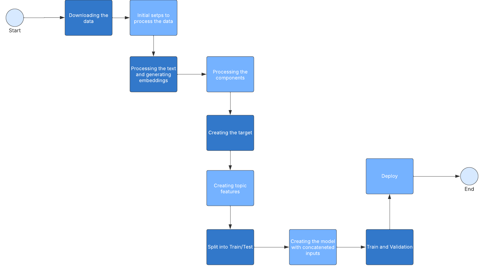

# 🚀 NLP Multi-Label Text Classification for Vehicle Complaints
**Description:** This project focuses on building a Machine Learning pipeline to automatically classify vehicle complaints based on customer reports. The model predicts the type of potential problem in the vehicle, categorizing it into issues such as engine, safety, electrical, and more.

**Technologies Used:** Python, TensorFlow/Keras, BERT, NLP, Pandas, Scikit-learn

**Impact** : This solution helps automakers detect complaint patterns, anticipate recalls, and improve vehicle safety by classifying potential issues in reported cases.


## Project Structure

```bash
├── .git/               # Git directory
├── data/               # Data used in the project
├── models/             # Trained or pre-trained models
├── notebooks/          # Jupyter Notebooks for analysis and code
├── src/                # Main source code of the project
├── .gitattributes      # Git-specific configurations
├── .gitignore          # Files and folders ignored by Git
├── env.yml             # Conda environment configuration
├── LICENSE             # Project license
├── README.md           # Main documentation
├── Report.docx         # Project report
├── set_up.py           # Initial setup script
├── TesteNLP.md         # Task
```

## Project Setup

To set up the project environment, you have two options. You can either use the `setup.py` script or create the environment manually using the `env.yml` file. Choose the option that works best for you.

### Option 1: Using the `setup.py` script

1. Make sure you have Python and `pip` installed on your machine.
2. Run the following command in the terminal to install the required dependencies:

   ```bash
   python setup.py install
   ```

### Option 2: Using the `env.yml` file

1. Ensure that you have Conda installed on your machine.
2. Create the environment using the following command:

   ```bash
   conda env create -f env.yml
   ```

 3. Once the environment is created, activate it with:
      ```bash
    conda activate ford_case_iel
      ```

## API Endpoints

The API provides multiple endpoints to interact with the model. Below is the documentation for each endpoint.

### 🔹 Health Check
**Endpoint:**  
`GET /health`

**Description:**  
Checks if the API is running.

---

### 🔹 Get Available Models
**Endpoint:**  
`GET /models`

**Description:**  
Returns a list of available car models.

---

### 🔹 Sentiment Analysis
**Endpoint:**  
`POST /sentiment`

**Description:**  
Analyzes the sentiment of a given complaint text.

---

### 🔹 Predict Vehicle Issue
**Endpoint:**  
`POST /predict`

**Description:**  
Classifies a vehicle complaint into predefined categories.

**Request Example:**

```json
{
  "summary": "My engine makes a weird noise when accelerating.",
  "model": "RANGER SUPER CAB"
}
```

### How to Consume the API

You can interact with the API using curl, Python's requests library, or tools like Postman or Swagger UI.

#### Using Swagger UI
Swagger UI provides a user-friendly interface to interact with the API directly in your browser. Here's how you can use it:

1. Open the Swagger UI in your browser. (http://127.0.0.1:5000/)
2. Use the input fields provided for each endpoint (like /health, /  models, /predict, and /sentiment).
3. Click "Execute" to make requests and view responses.

#### Using curl


```json
curl -X POST "http://localhost:5000/api/predict" \
     -H "Content-Type: application/json" \
     -d '{"summary": "The brakes are not working properly.", 
     "model": "RANGER SUPER CAB"}'
```

---

## Steps for Data Processing and Model Development


### 1. Downloading the Data
**Description:** In this step, data is acquired from a reliable source, such as the NHTSA complaints dataset.  
**Objective:** Automate the data download process and ensure that the dataset is up to date.

---

### 2. Initial Steps to Process the Data
**Description:** Initial data preparation, including format verification, handling of missing values, duplicate entries, and data inconsistencies.  
**Objective:** Ensure that the dataset is clean and structured for subsequent steps.

---

### 3. Processing the Text and Generating Embeddings
**Description:** Complaint text is preprocessed to remove noise (e.g., special characters) and transformed into embeddings using BERT.  
**Objective:** Convert text into numerical representations for use in machine learning models.

---

### 4. Processing the Components
**Description:** Components mentioned in the complaints are mapped to general categories, such as engine, safety, and electrical issues.  
**Objective:** Create a target variable that simplifies problem classification by grouping related components under broader categories.

---

### 5. Creating the Target
**Description:** The target column is generated by combining component mappings with other relevant data points from the dataset.  
**Objective:** Define the dependent variable for the classification model.

---

### 6. Creating Topic Features
**Description:** Additional features are generated using a topic modeling approach.  
**Objective:** Enrich the dataset with additional semantic features that help improve model predictions.

---

### 7. Split into Train/Test
**Description:** The dataset is split into training and test sets.  
**Objective:** Evaluate model performance on unseen data by separating a portion of the dataset for testing.

---

### 8. Creating the Model with Concatenated Inputs
**Description:** A neural network model is created, which takes two inputs: text embeddings and additional numeric features.  
**Objective:** The model learns to classify problems by combining multiple data representations for better accuracy.

---

### 9. Train and Validation
**Description:** The model is trained using the training data while its performance is monitored on the validation set. The following metrics are calculated during training:  

- **Accuracy:** Measures the proportion of correct predictions.  
- **AUC (Area Under the Curve):** Evaluates the model's ability to distinguish between positive and negative classes.  
- **Recall:** The proportion of actual positive cases correctly identified by the model.  
- **Precision:** The proportion of positive predictions that are actually correct.

**Objective:** Optimize the model's performance by adjusting parameters and monitoring for overfitting.
