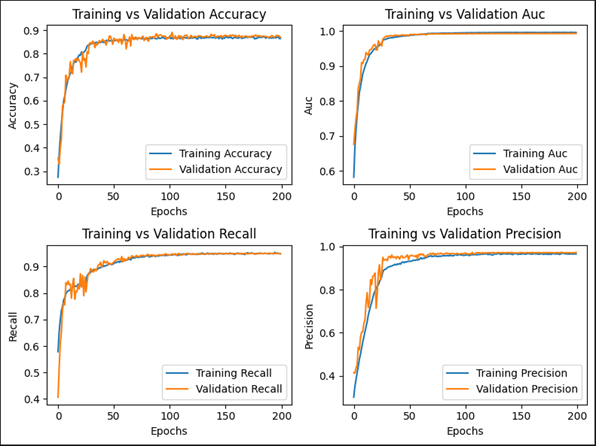

# 🚀 NLP Multi-Output Classification

## Steps for Data Processing and Model Development

### 1. Downloading the Data
**Description:** In this step, data is acquired from a reliable source, such as the NHTSA complaints dataset.  
**Objective:** Automate the data download process and ensure that the dataset is up to date.

---

### 2. Initial Steps to Process the Data
**Description:** Initial data preparation, including format verification, handling of missing values, duplicate entries, and data inconsistencies.  
**Objective:** Ensure that the dataset is clean and structured for subsequent steps.

---

### 3. Processing the Text and Generating Embeddings
**Description:** Complaint text is preprocessed to remove noise (e.g., special characters) and transformed into embeddings using BERT.  
**Objective:** Convert text into numerical representations for use in machine learning models.

---

### 4. Processing the Components
**Description:** Components mentioned in the complaints are mapped to general categories, such as engine, safety, and electrical issues.  
**Objective:** Create a target variable that simplifies problem classification by grouping related components under broader categories.

---

### 5. Creating the Target
**Description:** The target column is generated by combining component mappings with other relevant data points from the dataset.  
**Objective:** Define the dependent variable for the classification model.

---

### 6. Creating Topic Features
**Description:** Additional features are generated using a topic modeling approach.  
**Objective:** Enrich the dataset with additional semantic features that help improve model predictions.

---

### 7. Split into Train/Test
**Description:** The dataset is split into training and test sets.  
**Objective:** Evaluate model performance on unseen data by separating a portion of the dataset for testing.

---

### 8. Creating the Model with Concatenated Inputs
**Description:** A neural network model is created, which takes two inputs: text embeddings and additional numeric features.  
**Objective:** The model learns to classify problems by combining multiple data representations for better accuracy.

---

### 9. Train and Validation
**Description:** The model is trained using the training data while its performance is monitored on the validation set. The following metrics are calculated during training:  

- **Accuracy:** Measures the proportion of correct predictions.  
- **AUC (Area Under the Curve):** Evaluates the model's ability to distinguish between positive and negative classes.  
- **Recall:** The proportion of actual positive cases correctly identified by the model.  
- **Precision:** The proportion of positive predictions that are actually correct.

**Objective:** Optimize the model's performance by adjusting parameters and monitoring for overfitting.


## Project Structure

```bash
├── .git/               # Git directory
├── data/               # Data used in the project
├── models/             # Trained or pre-trained models
├── notebooks/          # Jupyter Notebooks for analysis and code
├── src/                # Main source code of the project
├── tests/              # Unit and integration tests
├── .gitattributes      # Git-specific configurations
├── .gitignore          # Files and folders ignored by Git
├── env.yml             # Conda environment configuration
├── LICENSE             # Project license
├── README.md           # Main documentation
├── Report.docx         # Project report
├── set_up.py           # Initial setup script
├── TesteNLP.md         # Notes and tests related to NLP
```

## Project Setup

To set up the project environment, you have two options. You can either use the `setup.py` script or create the environment manually using the `env.yml` file. Choose the option that works best for you.

### Option 1: Using the `setup.py` script

1. Make sure you have Python and `pip` installed on your machine.
2. Run the following command in the terminal to install the required dependencies:

   ```bash
   python setup.py install
   ```

### Option 2: Using the `env.yml` file

1. Ensure that you have Conda installed on your machine.
2. Create the environment using the following command:

   ```bash
   conda env create -f env.yml
   ```

 3. Once the environment is created, activate it with:
      ```bash
    conda activate ford_case_iel
      ```


### Etapas Obrigatórias:
 Marque as etapas que conseguir completar, sabemos q este é um teste complexo e que o tempo não é dos mais favoraveis, mas um dos pontos a se considerar será a produtividade do candidato, não q mt codigo apenas sejá algo produtivo :)

1. **[x] Aquisição e Pré-processamento de Dados**: Automatizar o download dos dados da NHTSA. Realizar o pré-processamento necessário, incluindo limpeza de texto (remoção de caracteres especiais, tratamento de stop words, stemming ou lematização), e transformação em um formato adequado para o treinamento do modelo. Documentar todas as etapas e justificar as escolhas realizadas.

2. **[x] Engenharia de Features**: Criar recursos relevantes a partir do texto das reclamações. Isso pode incluir, mas não se limita a: embeddings de palavras ou sentenças, word count, TF-IDF, n-grams, sentimento, tópicos extraídos via LDA ou modelos similares. Documentar o processo e a escolha dos recursos.

3. **[x] Treinamento do Modelo**: Treinar um modelo usando as features criadas. Justificar a escolha do modelo e da arquitetura (se aplicável), considerando as características dos dados e a tarefa de classificação/Clusterização/Regressão escolhida. Monitorar o treinamento e registrar métricas relevantes (precisão, recall, F1-score, AUC, etc.) para avaliar a performance do modelo.

4. **[x] Deploy e Versionamento**: Implementar o deploy do modelo treinado utilizando ferramentas de versionamento de código (como Git) e gerenciamento de pacotes (como pip ou conda). A solução deve ser facilmente reproduzível.

5. **[x] Relatório e Análise Estatística**: Gerar um relatório conciso que inclua:
    - Descrição (ou desenho (desenho conta mais kkk)) da pipeline de processamento de dados.
    - Análise estatística descritiva dos dados, com gráficos relevantes (histogramas, boxplots, etc.) e comentários interpretando os resultados, não vale só plotar graficozinho.
    - Detalhes sobre o modelo escolhido, incluindo a arquitetura (se aplicável) e justificativa para a sua escolha.
    - Resultados do treinamento, incluindo as métricas de avaliação e uma análise da performance do modelo.
    - Discussão sobre os pontos fortes e fracos da solução.

### Etapas Opcionais (para candidatos com maior experiência):

1. **[ ] Avaliação de Data Drift**: Utilizar um outro conjunto de dados da NHTSA (por exemplo, de um período diferente) para avaliar a robustez do modelo treinado e detectar a presença de data drift.

2. **[x] API ou Script de Consumo**: Criar uma API REST simples (ou um script) que permita consumir o modelo treinado e fazer previsões com novas reclamações.

3. **[ ] Implementação de testes automatizados**: Ambiente deve ser capáz de validar funções principais, similar a um ambiente de produção.
